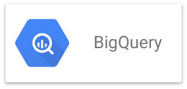

The intro video from the <https://cloud.google.com/bigquery> landing page with [a high level overview](https://youtu.be/eyBK9nj-7AA)

Detailed documentation for BigQuery is available [here](https://cloud.google.com/bigquery/docs/)

## Customer Testimonials

This is a very useful video from Google Next 2017  with a panel from Dr. Chad W. Jennings (BQ Product Manager) where
the panelists discuss [Migrating your data warehouse to BQ: lessons learned](https://youtu.be/TLpfGaYWshw)
- customers presenting include **Yahoo!**, **New York Times**, and **Blue Apron**
- it discusses customer use cases as presented by customer who have adopted BQ and migrated data to it
- it covers actual real-life use cases and their learnings from that process

## Training, Videos, and Education

A technical whitepaper with an [Inside Look into Google BigQuery](https://cloud.google.com/files/BigQueryTechnicalWP.pdf) showing the overall architecture

Here is a great intro to BQ by Jeff Davis as part of the Google Education Series
giving an outline of BQ features, and demos showing how to use BQ: [Analyzing Big Data in less time with Google BigQuery](https://youtu.be/qqbYrQGSibQ)

A video on [How to architect a collaborative big data platform](https://youtu.be/pogLXF97K68) as presented at
Google Next 2017

Jordan Tigani (one of the original engineers on Big Query) presenting at Google Next
about some [Advanced Features of Big Query: the data warehouse of the future](https://youtu.be/UueWySREWvk)

The Dremel technical paper is available [here](https://static.googleusercontent.com/media/research.google.com/en//pubs/archive/36632.pdf)

## Blogs

The [Google Big Data and Machine Learning Blog](https://cloud.google.com/blog/big-data/) provides
new and updated information about ongoing developments in these areas at Google
