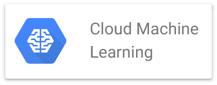

Detailed documentation for Google Cloud Platform's Machine Learning API is available [here](https://cloud.google.com/ml-engine/docs/)

Documentation on TensorFlow, the underlying ML system is available at <https://www.tensorflow.org>

## Training, Videos, and Education

This Google Next talk on [TensorFlow and Deep Learning without a PhD, Part 1](https://youtu.be/u4alGiomYP4) gives a 
great introduction to ML and TensorFlow in a very accessible manner

This Google Next talk, [TensorFlow and Deep Learning without a PhD, Part 2](https://youtu.be/fTUwdXUFfI8) continues
the earlier talk with more details and a deeper dive

This Google Next talk about [On-Device machine learning: TensorFlow on Android](https://youtu.be/EnFyneRScQ8) shows
how to leverage TensorFlow and ML in a mobile context

This Google Next talk shows [Machine Learning APIs by example](https://youtu.be/w1xNTLH1zlA) that
your enterprise can use to accelerate ML use in production applications with pre-built models

## Blogs

The [Google Big Data and Machine Learning Blog](https://cloud.google.com/blog/big-data/) provides
new and updated information about ongoing developments in these areas at Google

This blog post shows how to [Visualize data instantly with machine learning in Google Sheets](https://www.blog.google/products/g-suite/visualize-data-instantly-machine-learning-google-sheets/)

